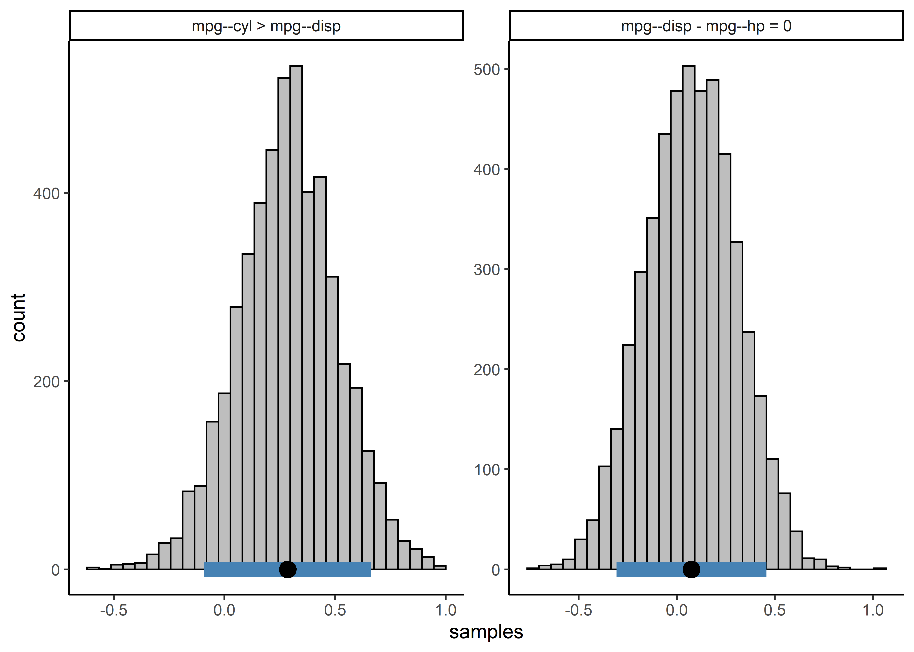

<!-- README.md is generated from README.Rmd. Please edit that file -->

# **BBcor**: Bayesian Bootstrapping Correlations

[](https://cran.r-project.org/package=BBcor)
[](https://cran.r-project.org/package=BBcor)
[](https://travis-ci.org/donaldRwilliams/BBcor)

The goal of BBcor is to provide an efficient way to obtain samples from
the posterior distribution of various correlation coefficients:

-   Pearson (`method = "pearson"`)

-   Spearman (`method = "spearman"`)

-   Gaussian Rank (`method = "gaussian_rank"`)

-   Kendall (`method = "kendall"`)

-   Blomqvist (`method = "blomqvist"`; median correlation)

-   Polychoric (`method = "polychoric"`)

The method is based on Rubin (1981) and described in Rodriguez and
Williams (2021).

## Installation

<!-- You can install the released version of BBcor from [CRAN](https://CRAN.R-project.org) with: -->
<!-- ``` r -->
<!-- install.packages("BBcor") -->
<!-- ``` -->

You can install the development version from
[GitHub](https://github.com/) with:

``` r
# install.packages("devtools")
devtools::install_github("donaldRwilliams/BBcor")
```

## Example: Correlations

This is a basic example which shows you how to solve a common problem,
i.e., estimating correlations:

``` r
library(BBcor)
## basic example code

# data
Y <- mtcars[,1:5]

# sample posterior
bb_sample <- bbcor(Y, method = "spearman")


# correlation matrix
bb_sample$cor_mean
#>            [,1]       [,2]       [,3]       [,4]       [,5]
#> [1,]  1.0000000 -0.9111911 -0.9081057 -0.8933434  0.6478409
#> [2,] -0.9111911  1.0000000  0.9284490  0.9016077 -0.6767364
#> [3,] -0.9081057  0.9284490  1.0000000  0.8501056 -0.6806186
#> [4,] -0.8933434  0.9016077  0.8501056  1.0000000 -0.5193009
#> [5,]  0.6478409 -0.6767364 -0.6806186 -0.5193009  1.0000000
```

## Example: Partial Correlations

It is also possible to obtain partial correlations from the object
`bb_sample`:

``` r
# convert
pcors <- cor_2_pcor(bb_sample)

# partial correlation matrix
pcors$pcor_mean
#>             [,1]        [,2]        [,3]        [,4]       [,5]
#> [1,]  1.00000000 -0.09485614 -0.38536808 -0.45399594  0.1852590
#> [2,] -0.09485614  1.00000000  0.46793163  0.49707586 -0.3042260
#> [3,] -0.38536808  0.46793163  1.00000000 -0.04717437 -0.1366473
#> [4,] -0.45399594  0.49707586 -0.04717437  1.00000000  0.3524484
#> [5,]  0.18525904 -0.30422602 -0.13664735  0.35244840  1.0000000
```

Note that the objects `bb_sample` and `pcors` include a 3D array with
the sampled correlation or partial correlation matrices.

## Example: Posterior Samples

The posterior samples can be summarized as follows

``` r
post_summary <- posterior_samples(pcors, summary = TRUE, cred = 0.95)

# print
post_summary
#>      Relation Post.mean Post.sd Cred.lb Cred.ub
#> 1    mpg--cyl   -0.0949  0.1692 -0.4124  0.2475
#> 2   mpg--disp   -0.3854  0.1569 -0.6693 -0.0585
#> 3   cyl--disp    0.4679  0.1374  0.1779  0.7034
#> 4     mpg--hp   -0.4540  0.1284 -0.6771 -0.1806
#> 5     cyl--hp    0.4971  0.1205  0.2392  0.7155
#> 6    disp--hp   -0.0472  0.1386 -0.3173  0.2221
#> 7   mpg--drat    0.1853  0.1810 -0.1898  0.5165
#> 8   cyl--drat   -0.3042  0.1439 -0.5619 -0.0110
#> 9  disp--drat   -0.1366  0.1428 -0.4123  0.1481
#> 10   hp--drat    0.3524  0.1917 -0.0608  0.6881
```

Note that setting `summary = FALSE` returns the posterior samples in a
data frame.

## Example: Comparing Correlations

Comparisons can then be made using the `compare` function using a string
to specify which comparisons to be made

``` r
comparisons <- c("mpg--cyl > mpg--disp",
                 "mpg--disp - mpg--hp = 0")
post_comparisons <- compare(comparisons,
                            obj = pcors,
                            cred = 0.9)

post_comparisons
#> bayeslincom: Linear Combinations of Posterior Samples
#> ------ 
#> Call:
#> lin_comb.bbcor(lin_comb = lin_comb, obj = obj, ci = ci, rope = rope, 
#>     contrast = contrast)
#> ------ 
#> Combinations:
#>  C1: mpg--cyl > mpg--disp 
#>  C2: mpg--disp - mpg--hp = 0 
#> ------ 
#> Posterior Summary:
#> 
#>    Post.mean Post.sd Cred.lb Cred.ub Pr.less Pr.greater
#> C1      0.29    0.23    -0.1    0.66    0.10       0.90
#> C2      0.07    0.23    -0.3    0.45    0.38       0.62
#> ------ 
#> Note:
#> Pr.less: Posterior probability less than zero
#> Pr.greater: Posterior probability greater than zero
```

``` r
plot(post_comparisons) +
  ggplot2::theme_classic()
```



or with a contrast matrix

``` r
contrast_mat <- matrix(c(1, -1, 0, 
                         0, 1, -1), 
                       nrow = 2, 
                       byrow = TRUE)


post_comparisons <- compare(c("mpg--cyl", "mpg--disp", "mpg--hp"),
                            obj = pcors,
                            contrast = contrast_mat,
                            cred = 0.9)

post_comparisons
#> bayeslincom: Linear Combinations of Posterior Samples
#> ------ 
#> Call:
#> lin_comb.bbcor(lin_comb = lin_comb, obj = obj, ci = ci, rope = rope, 
#>     contrast = contrast)
#> ------ 
#> Combinations:
#>  C1: C1 
#>  C2: C2 
#> ------ 
#> Posterior Summary:
#> 
#>    Post.mean Post.sd Cred.lb Cred.ub Pr.less Pr.greater
#> C1      0.29    0.23    -0.1    0.66    0.10       0.90
#> C2      0.07    0.23    -0.3    0.45    0.38       0.62
#> ------ 
#> Note:
#> Pr.less: Posterior probability less than zero
#> Pr.greater: Posterior probability greater than zero
```

## References

<div id="refs" class="references csl-bib-body hanging-indent">

<div id="ref-rodriguez2021painless" class="csl-entry">

Rodriguez, Josue E, and Donald R Williams. 2021. “Painless Posterior
Sampling: Bayesian Bootstrapped Correlation Coefficients.”

</div>

<div id="ref-rubin1981bayesian" class="csl-entry">

Rubin, Donald B. 1981. “The Bayesian Bootstrap.” *The Annals of
Statistics*, 130–34.

</div>

</div>
