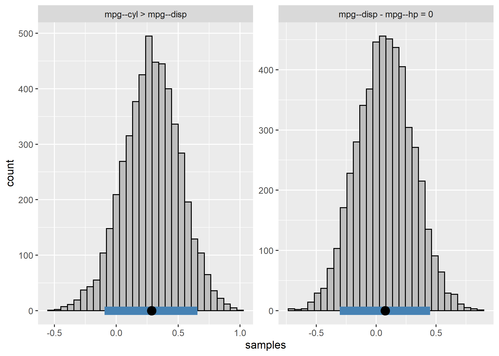

<!-- README.md is generated from README.Rmd. Please edit that file -->

# **BBcor**: Bayesian Bootstrapping Correlations

[](https://cran.r-project.org/package=BBcor)
[](https://cran.r-project.org/package=BBcor)
[](https://travis-ci.org/donaldRwilliams/BBcor)

The goal of BBcor is to provide an efficient way to obtain samples from
the posterior distribution of various correlation coefficients:

-   Pearson (`method = "pearson"`)

-   Spearman (`method = "spearman"`)

-   Gaussian Rank (`method = "gaussian_rank"`)

-   Kendall (`method = "kendall"`)

-   Blomqvist (`method = "blomqvist"`; median correlation)

-   Polychoric (`method = "polychoric"`)

The method is based on Rubin (1981) and described in Rodriguez and
Williams (2021).

## Installation

<!-- You can install the released version of BBcor from [CRAN](https://CRAN.R-project.org) with: -->
<!-- ``` r -->
<!-- install.packages("BBcor") -->
<!-- ``` -->

You can install the development version from
[GitHub](https://github.com/) with:

``` r
# install.packages("devtools")
devtools::install_github("donaldRwilliams/BBcor")
```

## Example: Correlations

This is a basic example which shows you how to solve a common problem,
i.e., estimating correlations:

``` r
library(BBcor)
## basic example code

# data
Y <- mtcars[,1:5]

# sample posterior
bb_sample <- bbcor(Y, method = "spearman")


# correlation matrix
bb_sample$cor_mean
#>            [,1]       [,2]       [,3]       [,4]       [,5]
#> [1,]  1.0000000 -0.9109799 -0.9075143 -0.8941014  0.6481496
#> [2,] -0.9109799  1.0000000  0.9286133  0.9020475 -0.6772422
#> [3,] -0.9075143  0.9286133  1.0000000  0.8502156 -0.6819241
#> [4,] -0.8941014  0.9020475  0.8502156  1.0000000 -0.5214303
#> [5,]  0.6481496 -0.6772422 -0.6819241 -0.5214303  1.0000000
```

## Example: Partial Correlations

It is also possible to obtain partial correlations from the object
`bb_sample`:

``` r
# convert
pcors <- cor_2_pcor(bb_sample)

# partial correlation matrix
pcors$pcor_mean
#>             [,1]        [,2]        [,3]        [,4]       [,5]
#> [1,]  1.00000000 -0.09513617 -0.38203255 -0.45602871  0.1836012
#> [2,] -0.09513617  1.00000000  0.47056971  0.49574370 -0.2996516
#> [3,] -0.38203255  0.47056971  1.00000000 -0.04758713 -0.1408058
#> [4,] -0.45602871  0.49574370 -0.04758713  1.00000000  0.3491303
#> [5,]  0.18360116 -0.29965155 -0.14080580  0.34913030  1.0000000
```

Note that the objects `bb_sample` and `pcors` include a 3D array with
the sampled correlation or partial correlation matrices.

## Example: Posterior Samples

The posterior samples can be summarized as follows

``` r
post_summary <- posterior_samples(pcors, summary = TRUE, cred = 0.95)

# print
post_summary
#>      Relation Post.mean Post.sd Cred.lb Cred.ub
#> 1    mpg--cyl   -0.0951  0.1679 -0.3974  0.2458
#> 2   mpg--disp   -0.3820  0.1617 -0.6706 -0.0422
#> 3   cyl--disp    0.4706  0.1375  0.1772  0.7069
#> 4     mpg--hp   -0.4560  0.1278 -0.6788 -0.1858
#> 5     cyl--hp    0.4957  0.1192  0.2504  0.7098
#> 6    disp--hp   -0.0476  0.1418 -0.3243  0.2345
#> 7   mpg--drat    0.1836  0.1834 -0.1908  0.5175
#> 8   cyl--drat   -0.2997  0.1442 -0.5630  0.0019
#> 9  disp--drat   -0.1408  0.1442 -0.4165  0.1509
#> 10   hp--drat    0.3491  0.1897 -0.0421  0.6815
```

Note that setting `summary = FALSE` returns the posterior samples in a
data frame.

## Example: Comparing Correlations

Comparisons can then be made using the `compare` function using a string
to specify which comparisons to be made

``` r
comparisons <- c("mpg--cyl > mpg--disp",
                 "mpg--disp - mpg--hp = 0")
post_comparisons <- compare(comparisons,
                            obj = pcors,
                            cred = 0.9)

post_comparisons
#> bayeslincom: Linear Combinations of Posterior Samples
#> ------ 
#> Call:
#> lin_comb.bbcor(lin_comb = lin_comb, obj = obj, ci = ci, rope = rope, 
#>     contrast = contrast)
#> ------ 
#> Combinations:
#>  C1: mpg--cyl > mpg--disp 
#>  C2: mpg--disp - mpg--hp = 0 
#> ------ 
#> Posterior Summary:
#> 
#>    Post.mean Post.sd Cred.lb Cred.ub Pr.less Pr.greater
#> C1      0.29    0.23   -0.09    0.66    0.10       0.90
#> C2      0.07    0.23   -0.31    0.46    0.38       0.62
#> ------ 
#> Note:
#> Pr.less: Posterior probability less than zero
#> Pr.greater: Posterior probability greater than zero

plot(post_comparisons)
```



or with a contrast matrix

``` r
contrast_mat <- matrix(c(1, -1, 0, 
                         0, 1, -1), 
                       nrow = 2, 
                       byrow = TRUE)


post_comparisons <- compare(c("mpg--cyl", "mpg--disp", "mpg--hp"),
                            obj = pcors,
                            contrast = contrast_mat,
                            cred = 0.9)

post_comparisons
#> bayeslincom: Linear Combinations of Posterior Samples
#> ------ 
#> Call:
#> lin_comb.bbcor(lin_comb = lin_comb, obj = obj, ci = ci, rope = rope, 
#>     contrast = contrast)
#> ------ 
#> Combinations:
#>  C1: C1 
#>  C2: C2 
#> ------ 
#> Posterior Summary:
#> 
#>    Post.mean Post.sd Cred.lb Cred.ub Pr.less Pr.greater
#> C1      0.29    0.23   -0.09    0.66    0.10       0.90
#> C2      0.07    0.23   -0.31    0.46    0.38       0.62
#> ------ 
#> Note:
#> Pr.less: Posterior probability less than zero
#> Pr.greater: Posterior probability greater than zero
```

## References

<div id="refs" class="references csl-bib-body hanging-indent">

<div id="ref-rodriguez2021painless" class="csl-entry">

Rodriguez, Josue E, and Donald R Williams. 2021. “Painless Posterior
Sampling: Bayesian Bootstrapped Correlation Coefficients.”

</div>

<div id="ref-rubin1981bayesian" class="csl-entry">

Rubin, Donald B. 1981. “The Bayesian Bootstrap.” *The Annals of
Statistics*, 130–34.

</div>

</div>
